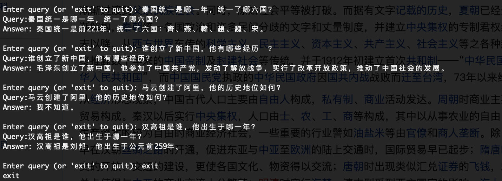

### 获取了在维基百科的中国历史数据并进行相关问答 https://zh.wikipedia.org/wiki/%E4%B8%AD%E5%9B%BD%E5%8E%86%E5%8F%B2 ，整理的数据放到了文件china_history.txt中。

### 脚本执行步骤：
1.安装关联包
``` shell 
pip install -r requirements.txt
```

2.引入openai key
```shell 
export OPENAI_API_KEY=....
```
也可以打开代码中的配置 # os.environ["OPENAI_API_KEY"] = "{your-api-key}"修改配置；

3.进行问答

```shell 
python3 embedding.py # embedding and persist
python3 qa.py # load data and qa
```

效果图如下：

